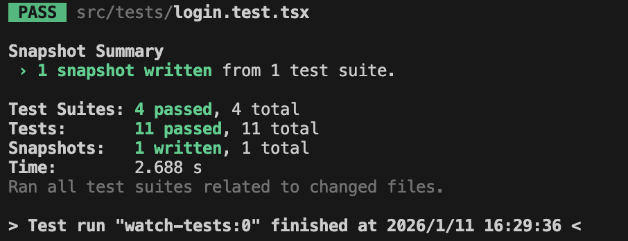

# 测试快照

首先从render方法解构出baseElement（render方法来源于testing Library）
调用jest的toMatchSnapShot()生成快照
项目tests目录中生成了snapshots目录



```ts
// Jest Snapshot v1, https://goo.gl/fbAQLP

exports[`测试快照 1`] = `
<body>
  <div>
    <div
      class="App"
    >
      <div>
        <label
          for="toggle"
        >
          显示
        </label>
        <input
          id="toggle"
          name="toggle"
          type="checkbox"
        />
      </div>
    </div>
  </div>
</body>
`;
```

之后在下次测试时 针对这个组件测试 就会将组建渲染出来的dom结构和之前的快照进行对比 查看是否一致
若和之前的快照一致 则测试通过 否则不通过


注意点：

- 快照本身并不验证渲染逻辑是否正确 只是防止意外更改 当测试快照不通过时 需要检查一下所需元素 样式 是否发生了不期望的改变
- 快照失败时 若确认渲染逻辑没有问题 可以更新快照 `jest --updateSnapshot`

## 避免大快照

在真实开发过程中 组件复杂 生成快照文件会过大
可以指定只生成某一个部分的快照（小快照）

```ts
test("测试快照", () => {
  render(<App />);
  const content = screen.getByTestId("list");
  expect(content).toMatchSnapshot();
  // expect(baseElement).toMatchSnapshot()
});
```

只会针对testUI组件生成快照

## 扩展场景

快照测试通常会被作为UI测试 除此之外 还有些特定场景下也可使用快照

```ts
// getUserById.ts
const getUserById = async (id: string) => {
  return request.get('user', {
    params: { id }
  })
}

// getUserById.test.ts
describe('getUserById', () => {
  it('可以获取 userId == 1 的用户', async () => {
    const result = await getUserById('1')
    expect(result).toEqual({
      // 非常巨大的一个 JSON 返回...
    })
  })
});
```

```ts
// getUserById.ts
const getUserById = async (id: string) => {
  return request.get('user', {
    params: { id }
  })
}

// getUserById.test.ts
describe('getUserById', () => {
  it('可以获取 userId == 1 的用户', async () => {
    const result = await getUserById('1')
    expect(result).toMatchSnapshot();
  })
});
```

## 总结

这一小节我们学会了 快照测试。快照测试的思想很简单：

先执行一次测试，把输出结果记录到 .*snap* 文件，以后每次测试都会把输出结果和 .*snap* 文件做对比。快照失败有两种可能：

- 业务代码变更后导致输出结果和以前记录的 .*snap* 不一致，说明业务代码有问题，要排查 *Bug*。
- 业务代码有更新导致输出结果和以前记录的 .*snap* 不一致，新增功能改变了原有的 *DOM* 结构，要用 *npx jest --updateSnapshot* 更新当前快照。

不过现实中这两种失败情况并不好区分，更多的情况是你既在重构又要加新需求，这就是为什么快照测试会出现 “假错误”。而如果开发者还滥用快照测试，并生成很多大快照， 那么最终的结果是没有人再相信快照测试。一遇到快照测试不通过，都不愿意探究失败的原因，而是选择更新快照来 “糊弄一下”。

要避免这样的情况，需要做好两点：

- 生成小快照。只取重要的部分来生成快照，必须保证快照是能让你看懂的
- 合理使用快照。快照测试不是只为组件测试服务，同样组件测试也不一定要包含快照测试。快照能存放一切可序列化的内容。
