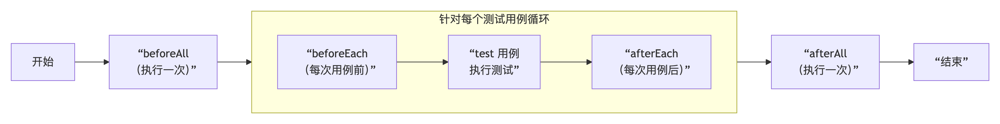
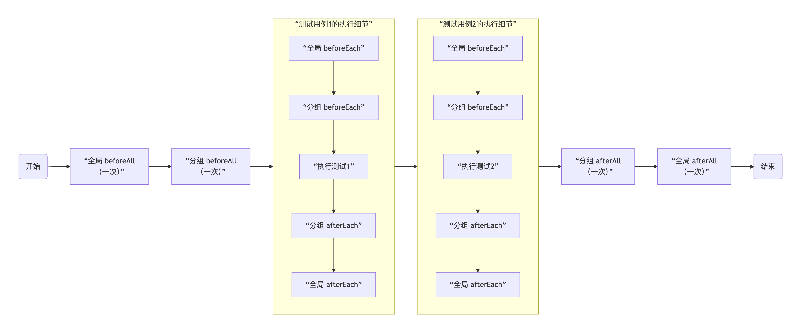
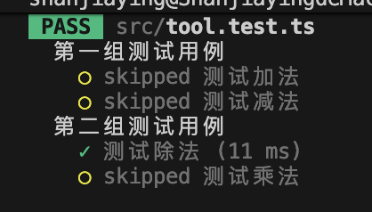

# 生命周期方法

生命周期方法均为全局方法
在jest中 生命周期方法分为两类：

- 重复性生命周期方法
  - beforeEach
  - afterEach
- 一次性的生命周期方法
  - beforeAll
  - afterAll

## 重复性的生命周期方法

这些方法都会被添加到每一个测试用例前后

```ts
// 在每个测试用例执行前运行
beforeEach(() => {
  console.log("全局的beforeEach");
});

// 在每个测试用例执行后运行
afterEach(() => {
  console.log("全局的afterEach");
});
```

## 一次性的生命周期方法

对应的方法：

- beforeAll
- afterAll

在整个测试开始之前 以及所有所有测试完成之后执行

```ts
// 整个测试套件的的第一个测试用例执行之前执行
beforeAll(() => {
  console.log("全局的beforeAll");
});

// 整个测试套件的最后一个测试用例执行之后执行
afterAll(() => {
  console.log("全局的afterAll");
});
```



## 在分组中添加生命周期函数

若测试用例过多 可以使用describe进行分组 在分组中书写生命周期方法
在分组中的生命周期方法 会变为局部的生命周期方法 仅对改组测试用例有效

如果有全局的beforeEach 又有分组的beforeEach 先执行全局的BeforeEach 再执行分组的BeforeEach
如果有全局的afterEach 又有分组的afterEach 先执行分组的afterEach 再执行全局的afterEach

如果有全局的beforeAll 又有分组的beforeAll 先执行全局的beforeAll(仅一次) 再执行分组的beforeAll（分组内仅一次）



在使用describe分组时 jest会在执行测试文件里的测试用例之前 会把所有describe内部执行一遍
即：先执行describe 再执行describe里面的所有测试用例

```ts
// 同步输出两个console之后才会执行test
// 第一组
describe("第一组测试用例", () => {
  console.log("开始执行第一组测试用例");

  test("测试加法", () => {
    const result = sum(2, 3);
    expect(result).toBe(5);
    console.log("加法测试通过");
  });

  test("测试减法", () => {
    const result = sub(5, 3);
    expect(result).toBe(2);
    console.log("减法测试通过");
  });
});

// 第二组
describe("第二组测试用例", () => {
  console.log("开始执行第二组测试用例");

  test("测试乘法", () => {
    const result = multiply(4, 3);
    expect(result).toBe(12);
    console.log("乘法测试通过");
  });

  test("测试除法", () => {
    const result = div(10, 2);
    expect(result).toBe(5);
    console.log("除法测试通过");
  });
});
```

因此 若想要在每组分组代码执行之前执行代码 需要在分组中使用beforeAll

## test.only

用来测试特定的测试用例
若一个测试套件中有10个测试用例 第x个测试用例中写了test.only 那么在测试整个测试套件中 只会执行第x个测试用例 生命周期函数不受影响

一般用于在某个测试套件中，某一个测试用例是否ok

```ts
describe("第一组测试用例", () => {
  beforeEach(() => {
    console.log("第一组的beforeEach");
  });

  afterEach(() => {
    console.log("第一组的afterEach");
  });

  beforeAll(() => {
    console.log("第一组的beforeAll");
  });

  afterAll(() => {
    console.log("第一组的afterAll");
  }); 

  test("测试加法", () => {
    const result = sum(2, 3);
    expect(result).toBe(5);
    console.log("加法测试通过");
  });

  test("测试减法", () => {
    const result = sub(5, 3);
    expect(result).toBe(2);
    console.log("减法测试通过");
  });
});

// 第二组
describe("第二组测试用例", () => {
  beforeEach(() => {
    console.log("第二组的beforeEach");
  });

  afterEach(() => {
    console.log("第二组的afterEach");
  });

  beforeAll(() => {
    console.log("第二组的beforeAll");
  });

  afterAll(() => {
    console.log("第二组的afterAll");
  }); 

  test("测试乘法", () => {
    const result = multiply(4, 3);
    expect(result).toBe(12);
    console.log("乘法测试通过");
  });

  test.only("测试除法", () => {
    const result = div(10, 2);
    expect(result).toBe(5);
    console.log("除法测试通过");
  });
});
```

最后的执行结果为 全局的beforeEach/afterEach/beforeAll/afterAll均会执行 第一组全部跳过（包括生命周期函数） 第二组的beforeEach/afterEach/beforeAll/afterAll均会执行 并且内部只会执行"测试除法"


从源码角度看 这些生命周期方法的背后 调用的都为同一个名为_addHook方法

```ts
const _addHook = (fn, hookType, hookFn, timeout) => {
  const asyncError = new _jestUtil.ErrorWithStack(undefined, hookFn);
  if (typeof fn !== 'function') {
    asyncError.message = 'Invalid first argument. It must be a callback function.';
    throw asyncError;
  }
  (0, _state.dispatchSync)({
    asyncError,
    fn,
    hookType,
    name: 'add_hook',
    timeout
  });
};
```
