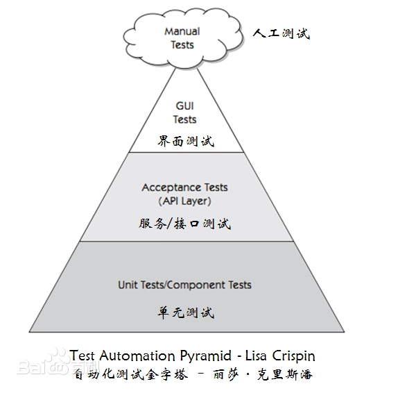
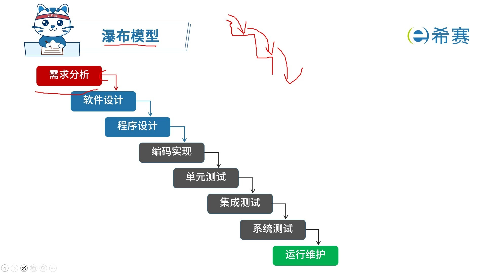
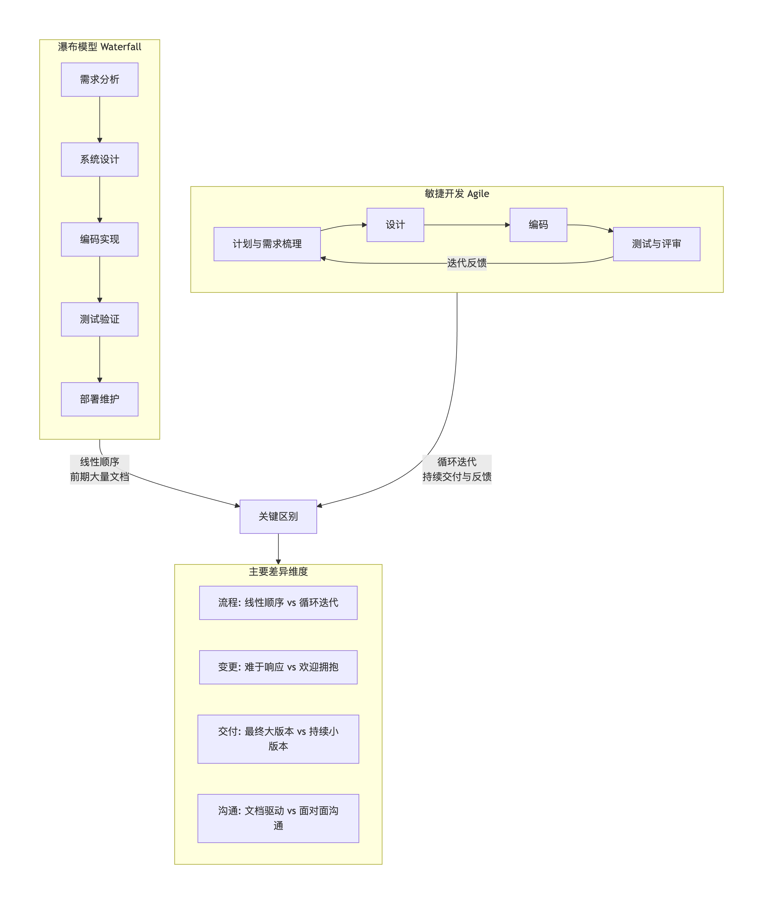
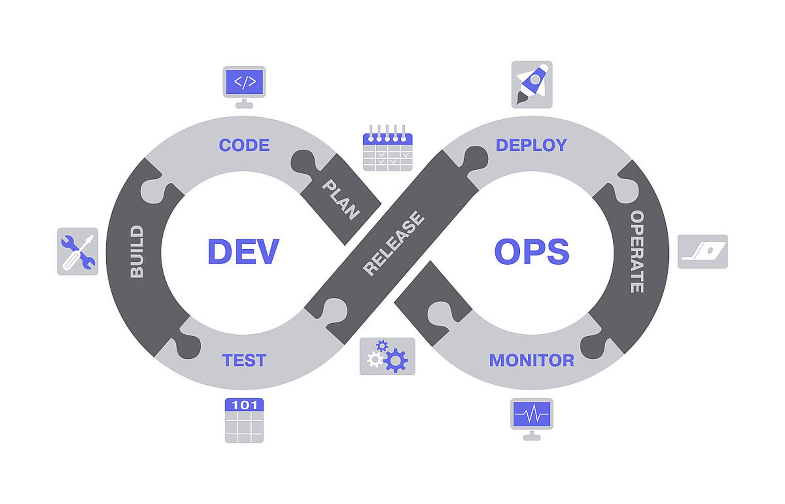

# 自动化测试概述

## 单元测试

测试金字塔：

E2E测试
集成测试
单元测试

软件开发中 单元测试做的是最多的
从测试金字塔角度看 越往上 测试成本是逐渐增加的
因为越到后期才抛出的bug 需要投入的精力和时间就会越多
其次 越往上测试的运行速度是逐渐增加的

单元测试性比喻其他两种测试，有以下优点:

- 写起来最容易
- 运行速度最快
- 反馈效果最好

在实际开发中 写的最多的就是单元测试
作为前端开发 平时面对的最多的就是组件 组件可以看作为一个最基础单元 需要保证这些组件功能的完整性 对组件的测试属于单元测试

## 软件开发模型和自动化测试

软件开发模型：软件开发流程的演变 不同的开发流程最终形成不同的开发模型

- 瀑布开发模型
- 敏捷开发模型
- DevOps开发模型

### 瀑布开发模型

最早期就存在的一种模型 由以下几个阶段组成

- 需求分析： 在进行软件开发之前 首先第一步就是做需求分析 明确要开发的软件有哪些需求 最终形成需求文档
- 设计： 需求分析完成后 即为设计阶段
  - 界面设计： ui设计师根据需求文档设计界面
  - 程序设计： 模块如何划分 有哪些接口 基本业务的处理流程
- 编码与实现： 根据设计好的方案 通过编码实现
- 测试：根据所述写的代码 做功能上的测试
- 发布于维护：发布上线 且持续的维护产品

瀑布模型作为整个软件开发模型中最早期的一个模型 是一个非常经典的模型 后面的模型都是基于瀑布模型的基础上做了一定的变化产生的

### 敏捷开发模型

敏捷开发模型是一种从90年代开始逐渐引起广泛注意的新型软件开发模型
这种模式主要用于硬怼需求频繁变化和需要快速开发的场景

瀑布模型和敏捷开发模型的区别：

在敏捷开发模型中 软件开发会被分解为一系列短周期迭代 每个迭代都包括需求分析、设计、编码实现、测试和部署
开发团队在迭代过程中会不断和客户沟通交流 随时根据客户的反馈进行方案的调整 保证软件开发方向上面的准确性

### DevOps开发模型：development（开发） operation（运维）

DevOps基本涵盖一个软件开发中的各个阶段
在DevOpos开发模型中 通过自动化实现软件的交付流程 让整体的构建、测试、发布都更加快速、频繁。

示例图：

- 持续开发：软件不断开发阶段 整个软件交付的结果会被拆分成多个短周期任务 每个任务完成之后立马进行交付
- 持续测试：对上一个步骤中开发的代码 使用自动化测试工具测试
- 持续集成：测试通过之后 将新的代码集成到现有的软件中
- 持续部署：集成完成后 将新集成的代码进行部署
- 持续监控：部署上线后 对部署的代码进行持续的监控 避免出现任何问题

| 维度 | 敏捷开发 (Agile) | DevOps |
| ---- | ---- | ---- |
| 核心目标 | 快速响应需求变化，交付可工作的软件给客户。 | 持续、稳定、高效地交付用户价值，并保障软件在产线稳定运行。 |
| 主要阶段 | 主要聚焦于开发阶段（从需求到可交付的代码包）。 | 贯穿开发、测试、部署、运维全生命周期。 |
| “拆分”的对象 | 将大的产品需求拆分成小的、可在一两周内完成的用户故事。 | 将大的发布过程拆分成小的、可自动化、低风险的部署单元。 |
| 主要产出 | 每个迭代结束时，产出一个可演示、可发布的功能增量（代码包）。 | 产出一条稳定、自动化、可重复的软件交付流水线，以及线上稳定运行的服务。 |
| 团队与角色 | 通常指开发团队内部（产品、开发、测试）的协作。 | 强调跨部门协作，尤其是开发(Dev)与运维(Ops)的壁垒打破与融合。 |
| 关键指标 | 业务价值、迭代速度、用户满意度。 | 部署频率、变更前置时间、平均恢复时间(MTTR)、可用性。 |
| 核心使能 | 用户故事、看板、每日站会、冲刺评审。 | 自动化工具链(CI/CD)、云基础设施、监控告警、容器化。 |

### 自动化测试

自动化测试属于DevOps开发模式中的一个阶段 指对新的代码通过一些自动化工具和测试框架进行全自动化的测试 通过之后进入下一个步骤

### 前端测试框架

不同的测试框架会有不同的测试重点 有些偏向于单元测试 有些偏向于E2E

jest/mocha/jasmine/cypress/puppeteer

jest: 老牌测试框架 侧重于单元测试、集成测试 Facebook开发
