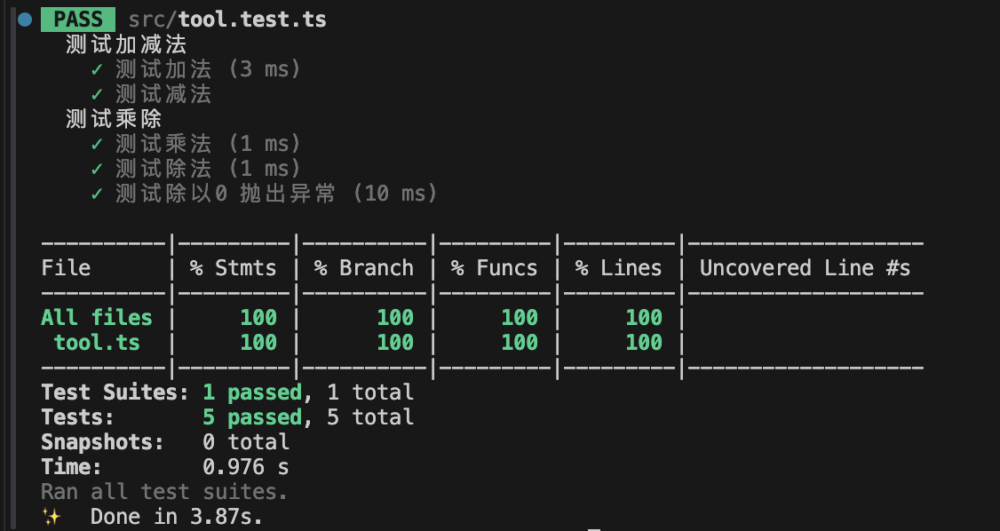
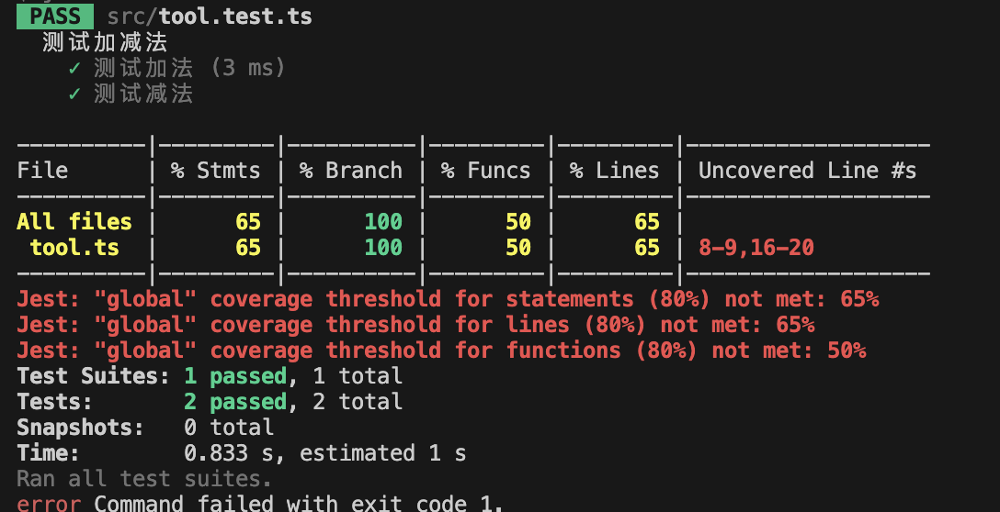

# jset 配置文件

<https://jestjs.io/docs/configuration>

生成配置文件

```ts
npx create-jest
```

jest.config.ts 常见配置项

collectCoverage: 收集并显示测试覆盖率 包含每个文件中每种类型的代码（语句、分支、函数和行）的测试覆盖率



- stmts: 包含语句的百分比
- branch: 包含分支的百分比
- Funcs: 包含函数的百分比
- Lines: 包含行的百分比
- uncovered lines: 违背覆盖测试的行号

当 collectCoverage 设置为 true 时 还可以设置 CoverageThreshold 代码覆盖率阀值

```ts
collectCoverage: true,
  coverageThreshold: {
    global: {
      branches: 80,
      functions: 80,
      lines: 80,
      statements: 80,
    },
  },
```



在项目根目录下会生成coverage目录：各种格式(xml/json/html)的测试报告
方便后续使用不同工具进行读取

```ts
coverageDirectory: "coverage",
```

testMatch: 指定jest应该运行那些测试文件 默认执行.test.js/ts
moduleFileExtensions: 指定jest查找测试文件时应该搜索那些文件
setupFilesAfterEnv: 指定jest在运行前应该执行哪些文件 在执行每个测试套件前都会执行这些文件
